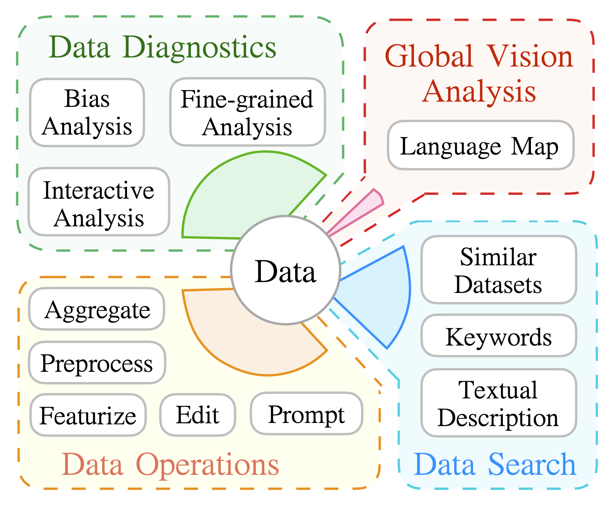

<p align="center">
    <br>
    
    <br>
  <a href="https://github.com/expressai/DataLab/blob/main/LICENSE"></a>
  <a href="https://github.com/expressai/DataLab/stargazers"></a>
  <a href="https://pypi.org/project//"></a>
  <a href=".github/workflows/ci.yml">
</p>


[DataLab](http://datalab.nlpedia.ai/) is a unified platform that allows for NLP researchers to perform a number of data-related tasks in an efficient and easy-to-use manner. In particular, DataLab supports the following functionalities:

    

    
    
<p align="center"> 

 </p> 

* **Data Diagnostics**: DataLab allows for analysis and understanding of data to uncover undesirable traits such as hate speech, gender bias, or label imbalance.
* **Operation Standardization**: DataLab provides and standardizes a large number of data processing operations, including aggregating, preprocessing, featurizing, editing and prompting operations.
* **Data Search**: DataLab provides a semantic dataset search tool to help identify appropriate datasets given a textual description of an idea.
* **Global Analysis**: DataLab provides tools to perform global analyses over a variety of datasets.


 


## Installation
DataLab can be installed from PyPi
```bash
pip install --upgrade pip
pip install datalabs
```
or from the source
```bash
# This is suitable for SDK developers
pip install --upgrade pip
git clone git@github.com:ExpressAI/DataLab.git
cd Datalab
pip install .
```

## Getting started (Documentation)
Here we give several examples to showcase the usage of DataLab. For more information, please refer to the corresponding sections in our [**documentation**](https://expressai.github.io/DataLab/).


```python
# pip install datalabs
from datalabs import load_dataset
dataset = load_dataset("ag_news")


# Preprocessing operation
from preprocess import *
res=dataset["test"].apply(lower)
print(next(res))

# Featurizing operation
from featurize import *
res = dataset["test"].apply(get_text_length) # get length
print(next(res))

res = dataset["test"].apply(get_entities_spacy) # get entity
print(next(res))

# Editing/Transformation operation
from edit import *
res = dataset["test"].apply(change_person_name) #  change person name
print(next(res))

# Prompting operation
from prompt import *
res = dataset["test"].apply(template_tc1)
print(next(res))

# Aggregating operation
from aggregate.text_classification import *
res = dataset["test"].apply(get_statistics)
```
 

## Acknowledgment
DataLab originated from a fork of the awesome [Huggingface Datasets](https://github.com/huggingface/datasets) and [TensorFlow Datasets](https://github.com/tensorflow/datasets). We highly thank the Huggingface/TensorFlow Datasets for building this amazing library. More details on the differences between DataLab and them can be found in the section.
We thank Antonis Anastasopoulos for sharing the mapping data between countries and languages, and thank Alissa Ostapenko, Yulia Tsvetkov, Jie Fu, Ziyun Xu, Hiroaki Hayashi, and Zhengfu He for useful discussion and suggestions for the first version.


